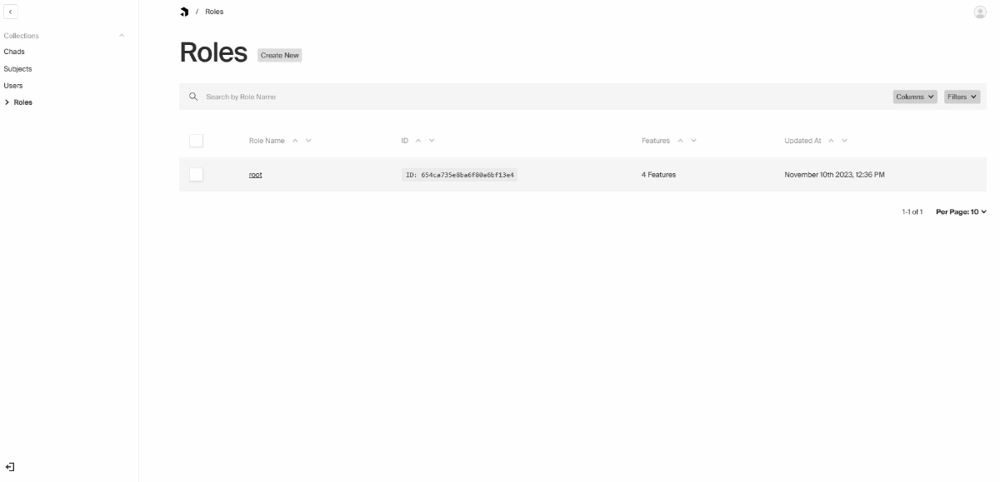

# A Collections / Globals Backed Payload RBAC Plugin

- Easily customizable `user` and `role` collection generation.
- Fine-grained access control configuration. All are editable in the `role` editing page!
- Fully customizable `access` functions and access control handler functions (*for endpoints*).
- Automatically populated `root` role with all access privileges. And a `root` user with this role as well!

## 📖 Table of Contents <a name="table-of-contents"></a>

- [📖 Table of Contents](#table-of-contents)
- [✨ Synopsis](#synopsis)
- [⚙️ Usage](#usage)
    - [🎨 Options](#options)
- [🔐 Authorization](#authorization)
    - [📚 Collections](#collections)
    - [🧭 Globals](#globals)
    - [🌠 Endpoints](#endpoints)
    - [✏️ Note](#note)

## ✨ Synopsis <a name="synopsis"></a>

* This plugin collects information from `collections`, `globals` and user provided extra `synopses` to build a collection of unified `features` which looks like the following data structure:
```javascript
{
  feature: string, // the slug of a collection or a global
  traits: string[], // a collection of field names or endpoint (which belongs to the collection or global) paths
  verbs: string[], // create, read, update, delete
}[] // a collection of this of all the collections, globals and user provided synopses
```

* Then the data is used to bring to us this:



## ⚙️ Usage <a name="usage"></a>

```shell
yarn add payload-warding
```
```shell
npm i payload-warding
```

```javascript
// ...
import warding, { convention } from "payload-warding";

//...
export default buildConfig({
  // ...
  plugins: [
    // ...
    warding(
      convention.opts({
        root: { email: process.env.YOUR_ROOT_EMAIL!, password: process.env.YOUR_ROOT_PASSWORD! },
      }),
    ),
    // ...
  ],
  // ...
});
// ...
```

The `convention.opts` will deeply merge your options with predefined default options using a function implements [*`RFC-7386 JSON Merge Patch`*](https://datatracker.ietf.org/doc/html/rfc7386), see [convention.ts](src/convention.ts) for details.

### 🎨 Options <a name="options"></a>

* `root`
```javascript
/**
 * The root user's email and password. If not provided, the root user will not
 * be created.
 */
root?: {
  email: string;
  password: string;
};
```
Please note that the user created in the `create-first-user` page will be automatically bound with a `root` role. So it's fine to skip the root user creation.
* `user`
```javascript
/**
 * The user {@link Options}.
 */
user?: Options;

type Options = {
  slug: string;
  fields?: Field[]; // payload's Field type
  title?: string;
  tag?: SpecLabels;
};

type SpecLabels = {
  plural?: Record<string, string> | string;
  singular?: Record<string, string> | string;
};
```
* `role`
```javascript
/**
 * The role {@link Options}.
 */
role?: Options;
```
* `label`
```javascript
/**
 * All the labels for plugin introduced collections, fields and select options.
 */
label?: Label;
```
* `ext`
```javascript
/**
 * Extended features in the form of {@link Synopsis}s.
 */
ext?: Synopsis[];

type Synopsis = {
  slug: string;
  traits: [string, Label | undefined][];
  label?: Label;
};

type Label = Record<string, string> | string;
```
This paired with the `check` function in [convention.ts](src/convention.ts) can be used to build custom access control upon the `user + role` system provided by this plugin.
* `mod`
```javascript
/**
 * Modifies the {@link Built} result after {@link Warding.build}.
 */
mod?: (w: Built) => Built;

type Built = {
  collections: { user: CollectionConfig; role: CollectionConfig };
  warden: Warden;
  populate: Populate;
  initialize: Initialize;
  initializationExtra?: { user: any; role: any };
};
```
Additional config options could be easily added to the user and role via this, See [factory/spec.ts](src/factory/spec.ts) for details.
* `mute`
```javascript
/**
 * Disable this plugin without uninstalling it.
 */
mute?: boolean;
```

## 🔐 Authorization <a name="authorization"></a>

### 📚 Collections <a name="collections"></a>

Authorizations of ***Collections*** are provided by adding `access` functions to all possible `collections`, `fields`...and so on. The said `access` functions will ask for a specific `feature`, `traits`, `verbs` combination to be present, or otherwise reject the operation it is assigned to. 

For example, the expected `feature`, `traits`, `verbs` combination for which an `access.create` of a `collection` **chad** will ask looks like this:
```javascript
{
  feature: "chad",
  trais: [],
  verbs: ["create"]
}
```
Any user who has a `role` with a `feature` **chad** and any `trait` (*which, if is left empty in the role editing page, will have a default "_" `trait` assigned*) of verb **create** can pass the check. As for the `access.update` of a `field` **age** of the `collection` **chad**, it looks like this:
```javascript
{
  feature: "chad",
  trais: ["age"],
  verbs: ["update"]
}
```

### 🧭 Globals <a name="globals"></a>

Authorizations of ***Globals*** are provided the same way as [Collections](#collections)

### 🌠 Endpoints <a name="endpoints"></a>

Authorizations of ***Endpoints*** are provided by prepending **check** functions in the `handler` function arrays. The **check** functions basically do the same as those `access` functions mentioned above, in which case the `verbs` are determined by the endpoint's http method as such:
```javascript
{
  post: "create",
  connect: "read",
  options: "read",
  head: "read",
  get: "read",
  put: "update",
  patch: "update",
  delete: "delete",
}
```
### ✏️ Note <a name="note"></a>
***
> You can also choose to skip the authorization for specific `collections`, `globals` or some of their `fields` or `endpoints` by assigning the `custom.warding.should` to false or `custom.warding.should.[verb]` flags of corresponding `verbs` to false. 
> ***
> Alternatively, if an access function is customly assigned in `collections`, `globals` or `fields`, the authorization will always be skipped but a plugin generated authorization function `req.context.warding` will be attached to the access function argument. So that plugin users can decide how and when to call the plugin generated authorization function.
> ***
> The `custom.warding.should` and `custom.warding.should.[verb]` flags assigned in `fields` or `endpoints` can override those assigned in their corresponding `collections` and `globals`.
> ***
> The plugin generated authorization function `req.context.warding` will always be attached to the handler function's argument when `endpoints` have the `custom.warding.should` flag or `custom.warding.should.[verb]` flags assigned to false.
> ***
